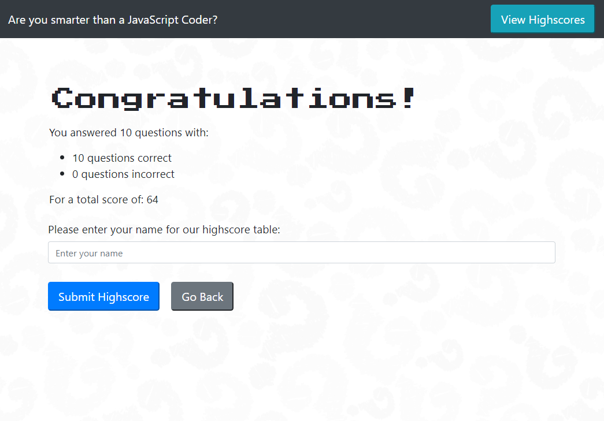

# 04 Web APIs: Code Quiz
UWA Project, Week 4





## Project Description
For this project we needed to create a timed quiz on JavaScript that stores highscores to the localStorage, allows the user to reset the scores and compare their score to the top scores.

The main goal was:
```
AS A coding bootcamp student
I WANT to take a timed quiz on JavaScript fundamentals that stores high scores
SO THAT I can gauge my progress compared to my peers
```

## Acceptance Criteria

```
GIVEN I am taking a code quiz
WHEN I click the start button
THEN a timer starts and I am presented with a question
WHEN I answer a question
THEN I am presented with another question
WHEN I answer a question incorrectly
THEN time is subtracted from the clock
WHEN all questions are answered or the timer reaches 0
THEN the game is over
WHEN the game is over
THEN I can save my initials and score
```

## Link to Deployed Application
https://diemrbond.github.io/JavascriptQuiz/

## Author
Andrew Kelleher 
www.github.com/diemrbond